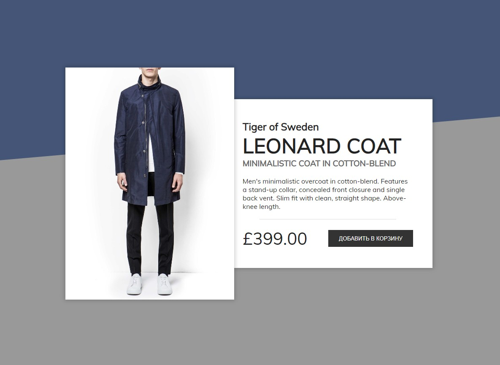

# Страница интернет-магазина

Учебный проект курса [React для JS-разработчиков](https://netology.ru/programs/react)

## **Задача**

Создание React-компонента ShopItemFunc (функциональный компонент), с помощью которого возможно реализовывать представление информации о товарах из каталога на сайте в таком виде (компонент обведён пунктирной линией):


## **Описание компонента**

Компонент должен иметь один props `item`, в котором он ожидает объект с информацией о товаре со следующими свойствами:

- `brand` — название производителя товара;
- `title` — название товара;
- `description` — краткое описание товара;
- `descriptionFull` — подробное описание товара;
- `price` — цена товара;
- `currency` — валюта товара.

Компонент должен создавать DOM элемент следующей структуры:

```JavaScript
<div class="main-content">
  <h2>Tiger of Sweden</h2>
  <h1>Leonard coat</h1>
  <h3>Minimalistic coat in cotton-blend</h3>
  <div class="description">
    Men's minimalistic overcoat in cotton-blend. Features a stand-up collar, concealed front closure and single back vent. Slim fit with clean, straight shape. Above-knee length.
  </div>
  <div class="highlight-window mobile"><div class="highlight-overlay"></div></div>
  <div class="divider"></div>
  <div class="purchase-info">
    <div class="price">£399.00</div>
    <button>Добавить в корзину</button>
  </div>
</div>
```
## **Стек технологий**


## [**Демо**](https://store-func.vercel.app/)

